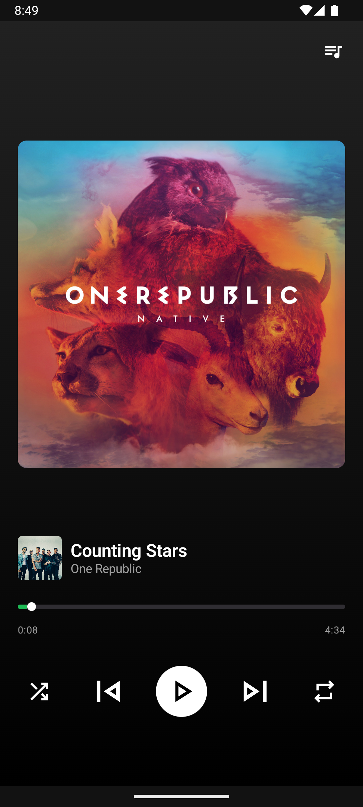
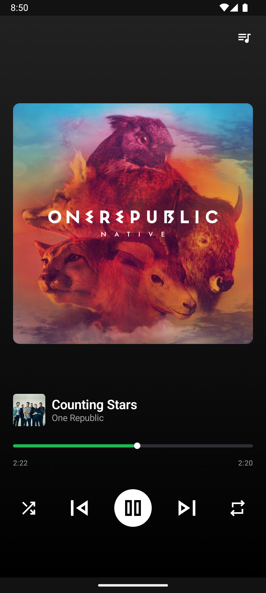
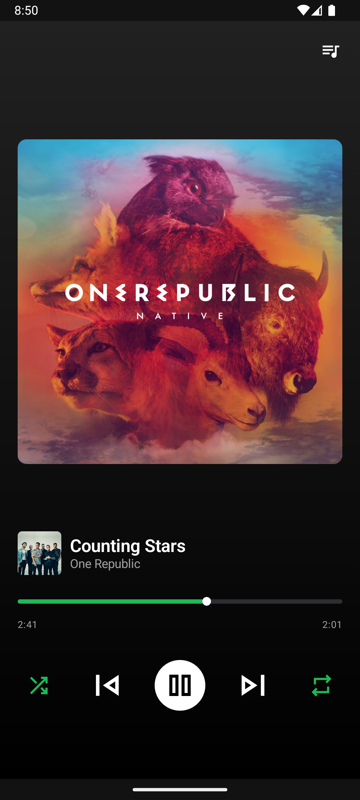
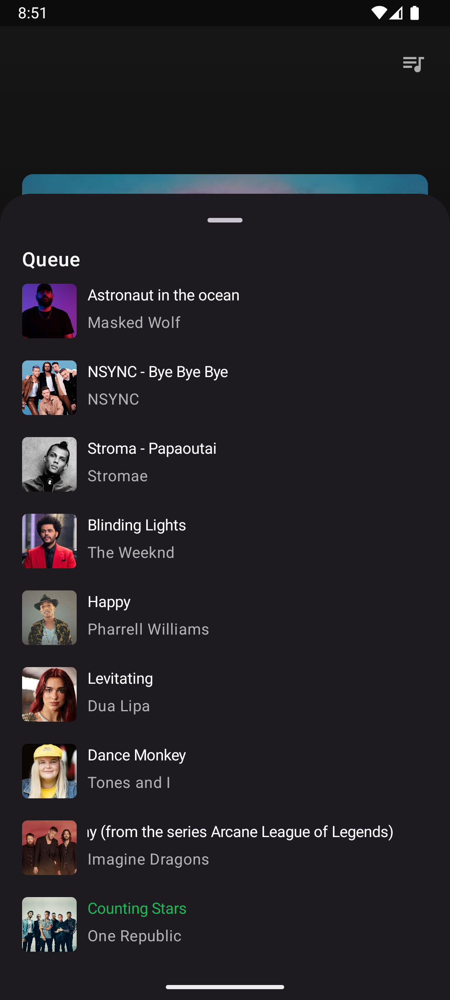
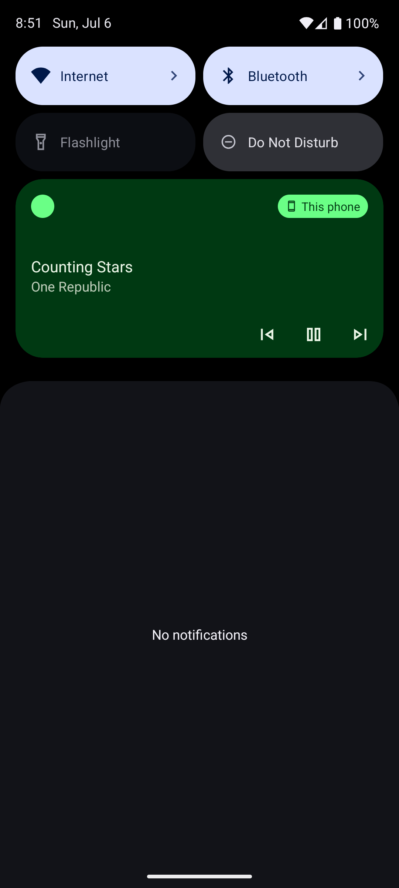

# SpotifyDemo 🎵

**SpotifyDemo** is a music player application built with **Jetpack Compose**, inspired by Spotify’s music playback screen. The app supports background music playback and provides full media control via the Android notification panel.

## ✨ Features

- 🎧 Clean and modern music player UI  
- 🔊 Background music playback using a foreground service  
- 🛎️ Media control via notification panel (Play, Pause, Next, Previous)  
- ⏱️ Seek bar to display and control music progress  
- 📡 Handles system events with a BroadcastReceiver  

## 🛠️ Tech Stack

- **Jetpack Compose** – Declarative UI framework for modern Android apps  
- **MediaSession** – Integrates with system-wide media controls  
- **MediaPlayer** – Plays audio files from local assets  
- **Foreground Service** – Enables playback even when the app is not in the foreground  
- **BroadcastReceiver** – Listens for custom and system intents  
- **Coroutines** – Manages asynchronous tasks and timers  
- **ViewModel** – Holds UI state and communicates with the service layer  

## 📸 Screenshots

> 
|  |  |  | 
|-------------------------------------|-------------------------------------|-------------------------------------|
|  |  |

## 🚀 Getting Started

To run the project locally:

```bash
git clone https://github.com/Slankss/SpotifyDemo.git
